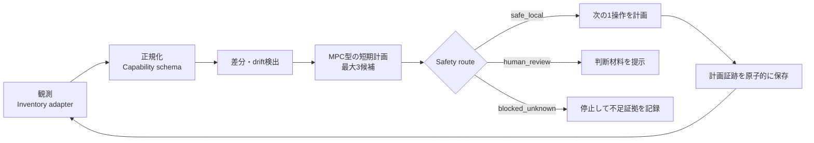

# 運用契約

Capability Atlasの自走単位は、定期実行そのものではなく、再現可能な`run-once`です。

## ローカル実行

`npm run smoke:ops`は、同梱fixtureを読み取り、最大3件の短期計画を作り、`artifacts/evidence/`へJSON証跡を保存します。この段階は計画・観測smokeであり、candidate操作そのものは実行しません。shell、network、認証、設定変更、インストールは行いません。

証跡はW3C PROVの考え方を最小限に取り入れ、actor、activity、source、時刻、入力hash、次の操作、routeを含みます。生成JSONはGit管理対象外です。

## 安全境界

- 自動計画: `local_read_smoke`のみ。executorは未実装で、現MVPは操作を実行しない。
- 人間レビュー: auth、settings、push、pull request、publish、external send、paid action。
- 未知の操作: `blocked_unknown`としてfail closed。
- 1回のrunで候補は最大3件、次手は1件まで。現MVPでは実行せず、executor追加後も完了後は必ず再観測する。
- `adopted`への昇格、scheduler登録、実インストールは別の人間レビューを必要とする。

## 既存資産との接続

このrepoへ共有基盤を複製しません。Projects環境では、証跡台帳を`shared/lib/event_ledger.py`、運用smokeを`shared/scripts/docs_to_smoke_loop.py`、scheduler driftを`shared/scripts/codex_runtime_feedback_smoke.py`、PR直前検査を`repo-preflight`へ委譲します。接続不能な環境でも製品本体のfixture smokeとテストは単独で再現できます。

## 定期実行へ進む条件

1. `npm run verify`と`npm run smoke:ops`が安定して成功する。
2. 実collectorのsource、permission、timeout、rollbackがレビュー済みである。
3. scheduler所有者、重複防止、実行間隔、証跡TTLが承認済みである。
4. 失敗時に次回runが状態を再観測し、推測で昇格しない。

以上を満たした後、既存の所有権付きTask Scheduler wrapperを薄くadaptします。二重schedulerは作りません。
